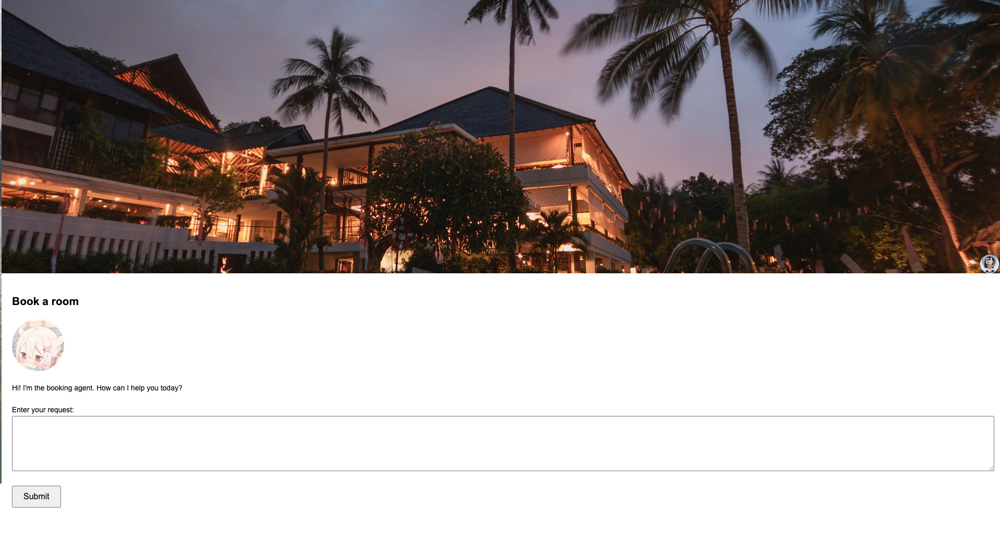
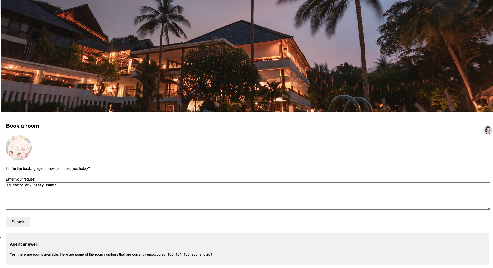
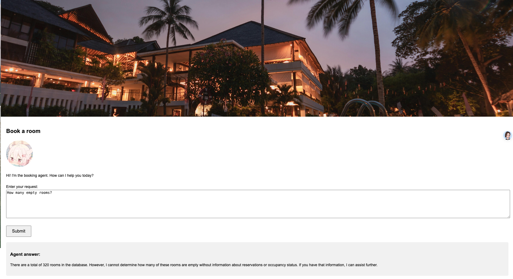

# Booking Room Agent

1. **Intelligent Recommendations**:  
   - The **Booking Room Agent** utilizes AI technology to provide smart recommendations tailored to your preferences.

2. **Room Comparison**:  
   - With the **Booking Room Agent**, you can easily compare room types, prices, and amenities across various hotels.

3. **24/7 Service**:  
   - Our **Booking Room Agent** offers 24/7 support to meet your booking needs anytime.

4. **Global Hotel Resources**:  
   - The **Booking Room Agent** provides access to a wide range of global hotel options for your convenience.

5. **Fast and Convenient Booking**:  
   - With the **Booking Room Agent**, you can complete your reservation in just a few minutes, making your travel planning seamless.

6. **User-Friendly Interface**:  
   - The **Booking Room Agent** features a simple and intuitive interface, ensuring a fast and efficient booking process.

7. **Exclusive Deals and Refund Policy**:  
   - The **Booking Room Agent** partners with thousands of hotels to bring you exclusive offers and ensures a hassle-free refund policy.

# Three Core Features

## 1. Chat with Users  
   🗨️ Seamless interaction to understand user needs.  
   

## 2. Find Suitable Rooms  
   🏨 Intelligent recommendations for tailored accommodations.  
   

## 3. Database Search  
   🔍 Fast and accurate searches for the best results.  
   
